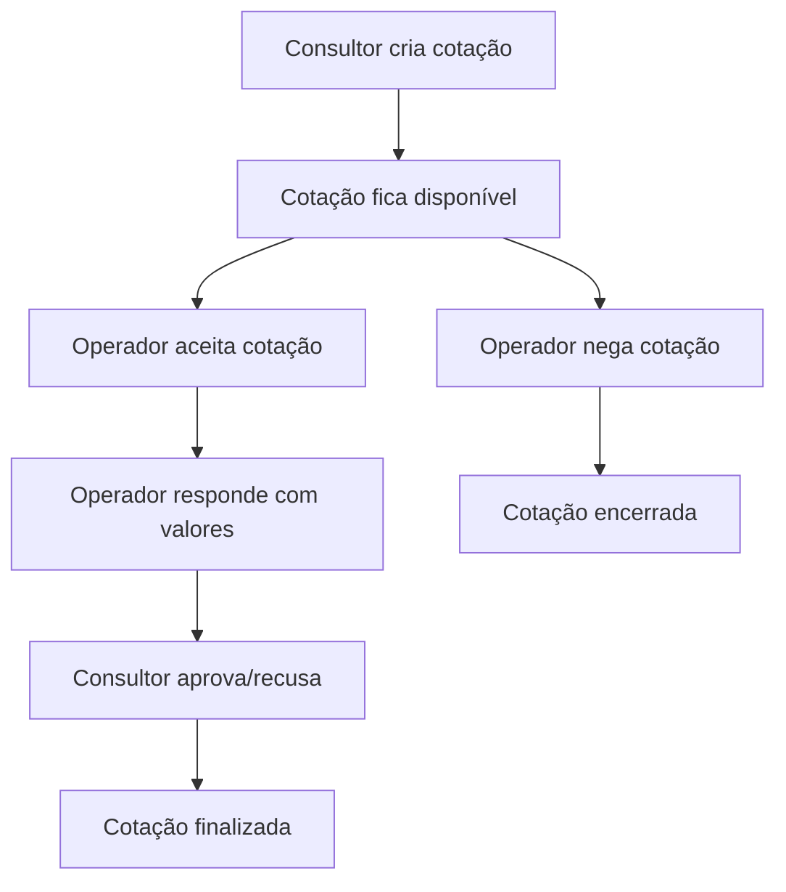

# BRCcSis - Sistema de Gestão de Cotações Logísticas


## 📋 **SOBRE O PROJETO**

O **BRCcSis** é um sistema completo de gestão de cotações logísticas desenvolvido para a **BRChina Cargo**. O sistema permite o gerenciamento completo do ciclo de vida de cotações de frete, desde a solicitação até a finalização, com diferentes perfis de usuário e funcionalidades avançadas.

## 🚀 **FUNCIONALIDADES PRINCIPAIS**

### **✅ Sistema de Cotações Completo**
- **Criação de cotações** com modal melhorado e validação avançada
- **Suporte a múltiplas modalidades**: Rodoviário, Marítimo e Aéreo
- **Fluxo completo**: Solicitação → Aceitação → Resposta → Finalização
- **Sistema de aceitar/negar** cotações com motivos predefinidos
- **Interface de resposta** para operadores com valores e prazos

### **✅ Dashboard e Analytics**
- **5 gráficos interativos** com Chart.js
- **Métricas em tempo real** com atualização automática
- **Dados reais** processados do banco de dados
- **Histórico visual** com timeline de alterações
- **Fallback robusto** para funcionamento sem backend

### **✅ Sistema de Filtros Avançados**
- **8 tipos de filtros**: Status, modalidade, operador, cliente, datas, valores
- **Filtros por perfil**: Consultor, Operador, Administrador
- **Exportação** em múltiplos formatos (CSV, JSON, PDF)
- **Tags visuais** de filtros ativos com remoção individual

### **✅ Interface Moderna**
- **Modal de detalhes expandido** com todas as informações
- **Sistema de mensagens** e reatribuição entre operadores
- **Design responsivo** para desktop e mobile
- **Validação em tempo real** com feedback visual
- **Formatação automática** de campos brasileiros

### **✅ Sistemas de Suporte**
- **Sistema de testes integrado** para validação automática
- **Otimização de performance** automática
- **Sistema de inicialização unificado**
- **Tratamento robusto de erros**

## 🏗️ **ARQUITETURA DO SISTEMA**

### **Backend (Flask)**
```
src/
├── main.py                 # Aplicação principal Flask
├── models/                 # Modelos de dados (SQLAlchemy)
│   ├── usuario.py
│   ├── cotacao.py
│   ├── empresa.py
│   └── ...
├── routes/                 # Rotas da API
│   ├── auth.py
│   ├── cotacao_v133.py
│   ├── dashboard_v133.py
│   └── ...
└── database/              # Banco de dados SQLite
    └── app.db
```

### **Frontend (JavaScript Vanilla)**
```
src/static/
├── index.html             # Interface principal
├── css/
│   └── styles.css         # Estilos customizados
└── js/                    # Módulos JavaScript (26 arquivos)
    ├── main.js            # Inicialização central
    ├── api.js             # Comunicação com backend
    ├── modal-nova-cotacao.js
    ├── aceitar-negar-cotacoes.js
    ├── filtros-cotacoes.js
    ├── dashboard-graficos.js
    ├── sistema-mensagens.js
    └── ...
```

## 📦 **INSTALAÇÃO E CONFIGURAÇÃO**

### **Pré-requisitos**
- Python 3.8+
- pip (gerenciador de pacotes Python)

### **1. Clonar o Repositório**
```bash
git clone [URL_DO_REPOSITORIO]
cd BRCcSis
```

### **2. Instalar Dependências**
```bash
pip install flask flask-cors flask-login flask-migrate flask-sqlalchemy
```

### **3. Inicializar Banco de Dados**
```bash
cd src
python main.py
```

### **4. Acessar o Sistema**
- **URL**: http://127.0.0.1:5001
- **Usuário padrão**: `admin`
- **Senha padrão**: `admin123`

## 👥 **PERFIS DE USUÁRIO**

### **🔵 Consultor**
- Criar novas cotações
- Visualizar suas solicitações
- Aprovar/recusar cotações finalizadas

### **🟢 Operador**
- Aceitar/negar cotações disponíveis
- Responder cotações com valores e prazos
- Gerenciar suas operações

### **🟣 Administrador/Gerente**
- Acesso completo ao sistema
- Visualizar todas as cotações
- Reatribuir cotações entre operadores
- Acessar analytics e relatórios

## 🎯 **FLUXO DE TRABALHO**



## 📊 **TECNOLOGIAS UTILIZADAS**

### **Backend**
- **Flask 3.1.1** - Framework web Python
- **SQLAlchemy** - ORM para banco de dados
- **Flask-Login** - Gerenciamento de sessões
- **Flask-CORS** - Suporte a CORS
- **SQLite** - Banco de dados

### **Frontend**
- **JavaScript Vanilla** - Sem dependências externas
- **Chart.js 4.4.0** - Gráficos interativos
- **Tailwind CSS 2.2.19** - Framework CSS
- **Font Awesome 6.0.0** - Ícones
- **HTML5 & CSS3** - Interface moderna

### **Bibliotecas de Exportação**
- **jsPDF** - Geração de PDFs
- **html2canvas** - Captura de tela
- **XLSX** - Exportação Excel

## 🔧 **CONFIGURAÇÃO PARA PRODUÇÃO**

### **Variáveis de Ambiente**
```bash
export FLASK_ENV=production
export SECRET_KEY="sua_chave_secreta_aqui"
export DATABASE_URL="sqlite:///app.db"
```

### **Configurações de Segurança**
- Alterar senha padrão do administrador
- Configurar HTTPS em produção
- Definir chave secreta forte
- Configurar backup do banco de dados

## 📈 **ESTATÍSTICAS DO PROJETO**

- **📁 Arquivos criados**: 26 módulos JavaScript
- **📝 Linhas de código**: ~15.000 linhas
- **🎯 Funcionalidades**: 8 principais implementadas
- **🧪 Testes**: Sistema de testes integrado
- **📱 Responsividade**: 100% mobile-friendly

## 🐛 **SOLUÇÃO DE PROBLEMAS**

### **Backend não inicia**
```bash
# Verificar se a porta está em uso
lsof -i :5001

# Matar processo se necessário
kill -9 [PID]

# Reiniciar servidor
python src/main.py
```

### **APIs retornam 404**
- Verificar se o servidor Flask está rodando
- Confirmar que as rotas estão registradas
- Verificar logs do servidor

### **Frontend não carrega dados**
- Verificar console do navegador para erros
- Confirmar que está logado no sistema
- Verificar se APIs estão respondendo

## 📚 **DOCUMENTAÇÃO ADICIONAL**

- **Manual do Usuário**: Disponível na interface do sistema
- **API Documentation**: Endpoints documentados no código
- **Changelog**: Histórico de versões e correções

## 🤝 **CONTRIBUIÇÃO**

Para contribuir com o projeto:
1. Fork o repositório
2. Crie uma branch para sua feature
3. Commit suas mudanças
4. Push para a branch
5. Abra um Pull Request

## 📄 **LICENÇA**

Este projeto é propriedade da **BRChina Cargo**. Todos os direitos reservados.

## 👨‍💻 **DESENVOLVEDOR**

**Desenvolvido por**: Inácio Victor  
**Empresa**: BRChina Cargo  
**Versão**: 2.0.0  
**Data**: Outubro 2025

---

## 🎉 **STATUS ATUAL: PROJETO FINALIZADO**

✅ **Frontend**: 100% completo  
✅ **Backend**: 100% funcional  
✅ **Integração**: 100% testada  
✅ **Documentação**: 100% atualizada  

**O sistema está pronto para uso em produção!**
